# 你好，这里是 然飞 - Ranfey

<table><tr>
  <td valign="top" style="border: none; vertical-align: top; padding-right: 100px; min-width: 500px;">
    
· ACGN重度依赖患者              |

    
· 一个玩各类移动端音游和街机音游的菜鸡(>_<)                      |

    
· 也许节假日会刷新在vrc跳舞的闭麦怪人(?)               |

    
· <em>最喜欢可爱和好吃的东西</em> !               |

    
· <em>只是觉得女孩子之间真是好啊</em>               |

    
· 人际上主张和平共处，求同存异（*＾-＾*） 

    
· 目前主要研究智能车辆 PNC (感知也会些就是了)--------|

    
· 喜欢 CTF ，是WEB手              |

    
· 会写写 WEB 和 bot              |

  </td>
  <td valign="top" style="border: none; vertical-align: top; min-width: 430px;">
    <h3>💻 编程语言</h3>
    

      
      
      
      
      
      
      
    

    <h3>⚡ 框架 & 平台</h3>
    

      
      
      
      
      
      
      
      
    

    <h3>🛠️ 工具 & 数据库</h3>
    

      
      
      
      
      
      
      
    

    </td></tr>
</table>

    <picture>
        <source media="(max-width: 767px)" srcset="./github-metrics.svg" width="100%">
        
    </picture>
    <picture>
        <source media="(max-width: 767px)" srcset="./yukiyuki.png" width="100%">
            
    </picture>

