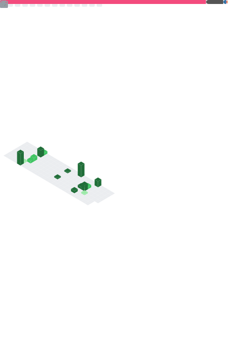

# 你好，这里是 然飞 - Ranfey

<table width="100%" cellpadding="0" cellspacing="0">
  <tr>
    <td valign="top">
      
<code>*-----------------------------------------------------------*</code>

      
· ACGN重度依赖患者

      
· 一个玩各类移动端音游和街机音游的菜鸡(&gt;_&lt;)

      
· 也许节假日会刷新在vrc跳舞的闭麦怪人(?)

      
· <em>最喜欢可爱和好吃的东西</em> !

      
· <em>只是觉得女孩子之间真是好啊</em>

      
· 人际上主张和平共处，求同存异（*＾-＾*） 

      
· 目前主要研究智能车辆 PNC (感知也会些就是了)

      
· 喜欢 CTF ，是WEB手

      
· 会写写 WEB 和 bot

      
<code>*-----------------------------------------------------------*</code>

    </td>
    <td valign="top">
      <h3>💻 编程语言</h3>
      <table>
        <tr>
          <td></td>
          <td></td>
          <td></td>
          <td></td>
          <td></td>
          <td></td>
          <td></td>
        </tr>
      </table>
      <h3>⚡ 框架 &amp; 平台</h3>
      <table>
        <tr>
          <td></td>
          <td></td>
          <td></td>
          <td></td>
          <td></td>
          <td></td>
          <td></td>
        </tr>
      </table>
      <h3>🛠️ 工具 &amp; 数据库</h3>
      <table>
        <tr>
          <td></td>
          <td></td>
          <td></td>
          <td></td>
          <td></td>
          <td></td>
          <td></td>
        </tr>
      </table>
    </td>
  </tr>
</table>

    <picture>
        <source media="(max-width: 767px)" srcset="./github-metrics.svg" width="100%">
        
    </picture>
    <picture>
        <source media="(max-width: 767px)" srcset="./yukiyuki.png" width="100%">
            
    </picture>

