# ranfey

    <picture>
        <source media="(max-width: 767px)" srcset="./github-metrics.svg" width="100%">
        
    </picture>
    <picture>
        <source media="(max-width: 767px)" srcset="./yukiyuki.png" width="100%">
            
    </picture>

